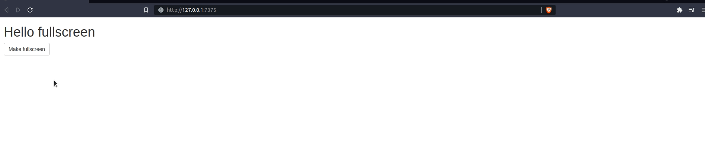
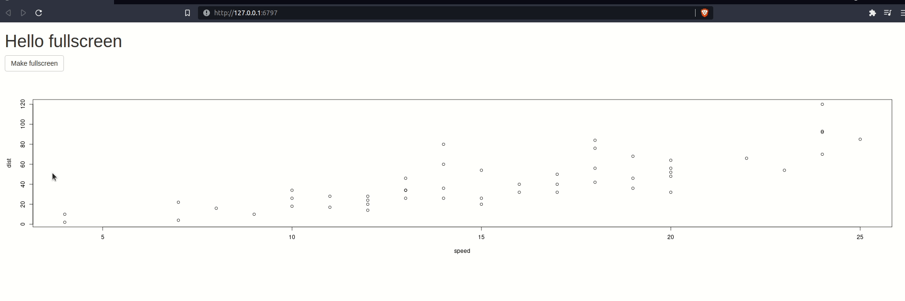

<!-- badges: start -->
<!-- badges: end -->

# fullscreen

Allow making R markdown documents, Shiny apps, or specific
element of these documents or app fullscreen.

## Installation

Get it from Github.

``` r
# install.packages("remotes")
remotes::install_github("JohnCoene/fullscreen")
```

## Examples

Use `fsButton` to create a button that makes the application
fullscreen. This works in both __Rmarkdown__ and __Shiny__.

```r
library(shiny)
library(fullscreen)

ui <- fluidPage(
	h1("Hello fullscreen"),
	fsButton("Make fullscreen")
)

server <- function(...){}

shinyApp(ui, server)
```



You can customise the tag used for the button (default `<a>`) with
the `.tag` argument, e.g.: `.tag = actionButton`. You can also
create a link (instead of a button) with `fsLink`.

By default the entire page/app is made fullscreen. You can also
make specific elements fullscreen with the `.target` argument.


```r
library(shiny)
library(fullscreen)

ui <- fluidPage(
	h1("Hello fullscreen"),
	fsButton("Make fullscreen", .target = "plot"),
	plotOutput("plot")
)

server <- function(input, output, session){
	output$plot <- renderPlot(plot(cars))
}

shinyApp(ui, server)
```



You can also use the server with the `fs_server` function. 
This, of course, only works in __Shiny__.

``` r
library(shiny)
library(fullscreen)

ui <- fluidPage(
	h1("Hello fullscreen"),
	actionButton(
		"fs",
		"Fullscreen via server"
	)
)

server <- function(input, output, session){
	observeEvent(input$fs,{
		fs_server()
	})
}

shinyApp(ui, server)
```
